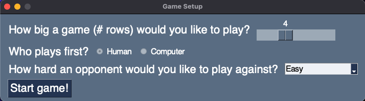
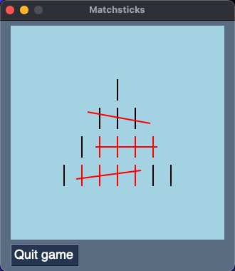

# Matchsticks

Welcome to Matchsticks, a 2-player game in which you play against a
computer opponent which learned through self-play (or, you can hone
your skills by playing against a game-theoretic perfect player).

Matchsticks is almost exactly like standard Nim, with an important
distinction: when you cross off a stick in the middle of a row,
the row is divided into two smaller rows, so the next player cannot
cross of sticks from both of those new rows at the same time.

I started this project because I was unsure whether the same approach for
optimal play from normal Nim also applied in this setting. I figured
writing a simple RL agent would be a good way to gain intuition
if the rule held. It turns out that it does, and I'm planning to write
an explanation of why this is the case in the near future (I'll link
to it here once I do).


## Installation
There are two options for playing the game.

1) If your computer is running macOS and you have Python3 installed,
then you should be able to play by downloading the "packaged game"
directory, and simple double-clicking on `Matchsticks.app`. Note that
   you'll probably have to agree to open a file from untrusted
   sources the first time you play
   

2) For the most flexibility, you can download the whole project and 
play as follows. Note that the game expects you have Python 3.9
   or newer; the game should run with any Python 3, but if you open
   the files in an IDE, it will complain about type annotations
   for anything earlier than Python 3.9.
   
- `cd` to the directory where you want the project to live 
  
Clone the repo and `cd` into it
```
$ git clone https://github.com/nikihowe/matchsticks.git
$ cd matchsticks
```

Create a virtual environment and install the necessary libraries
```
python3 -m venv venv
source venv/bin/activate
pip install -r requirements.txt
```

To run the game, from within the virtual environment,
you can either call `run.sh` or 
directly call `python run.py`.

When the game starts, you should see a screen which lets you
select the number of rows to play with, the difficulty
of the computer player, and who plays first (given perfect play,
depending on the number of starting rows, either the starting
player or the not-starting player should win 100% of the time!).



From there, you can choose your game options, and start the game!


You play by dragging the cursor across any number of matchsticks
in a given row. You're not allowed to draw across sticks which
have already been crossed off. The player who crosses off the last
stick loses!



Good luck, have fun, and please raise issues if you find any :).

## Bonus

If you're interested in seeing how the different difficulty levels
of the agents were trained, you can take a look at `dojo.py`, which
can be used to make new agents and train them against themselves
on arbitrary positions!

The RL agents' learning algorithm is based on the
"On-Policy First-Visit Monte Carlo Control" on page 101 of 
Sutton and Barto's *Reinforcement Learning* (2018). I imagine
there are significantly more efficient algorithms one could use
for this setting. Furthermore, it's worth noting that a tabular
approach as I used here is not feasible for games with many
rows, since the space of reachable game configurations
grows exponentially with number of rows.
